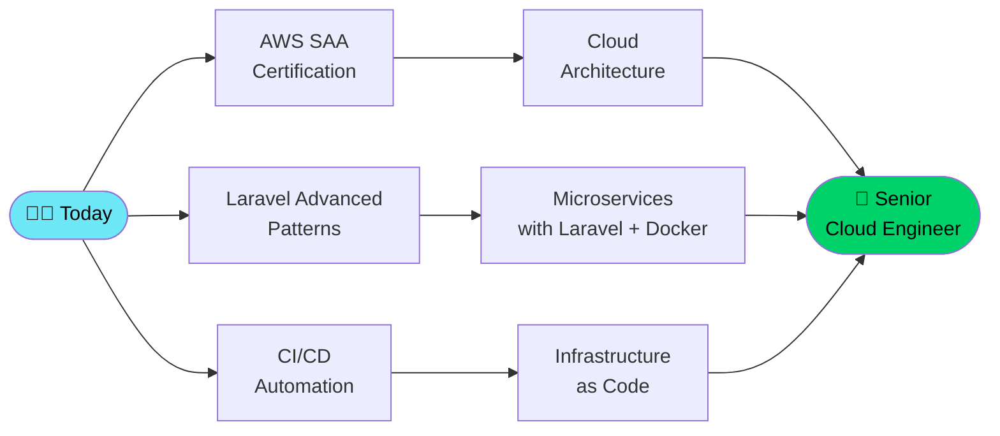

<div align="center">

<!-- Animated Banner -->


<!-- Typing Animation -->
<a href="https://github.com/Shurface123">
  
</a>

<br/>

<!-- Social Badges -->
<p>
  <a href="https://github.com/Shurface123?tab=followers">
    
  </a>
  <a href="https://www.linkedin.com/in/lovelace-john-kwaku-baidoo-771337356">
    
  </a>
  <a href="mailto:lovelacejohnkwakubaidoo@gmail.com">
    
  </a>
  
</p>

<!-- Availability Badge -->


</div>

---

## 🧠 Who Am I?


I'm a **Full-Stack Developer** and **Cloud Computing enthusiast** studying **Information Technology** at the **Regional Maritime University, Ghana**. I architect backend systems, ship production-grade web apps, and obsess over clean code and scalable infrastructure.

> *"I don't just write code — I engineer solutions that scale, perform, and matter."*

**What drives me:**
- 🔭 I'm currently building **EliteFit** — a full-stack gym management platform
- 🌱 Deep-diving into **AWS Architecture**, **Microservices**, and **DevOps automation**
- 👯 Looking to collaborate on **Open Source** projects and **impactful SaaS tools**
- 💬 Ask me about **PHP/Laravel**, **React**, **Node.js**, **MySQL**, or **Cloud infra**
- ⚡ Fun fact: I built a fictional gym to test real-world workflows — and it became my flagship project

<br clear="right"/>

---

## 💻 Tech Arsenal

<div align="center">

### Languages


### Frameworks & Libraries


### Cloud & DevOps


### Databases & Storage


### Tools & Workflow


</div>

---

## 🏗️ Architecture & Capabilities

<div align="center">

```
╔══════════════════════════════════════════════════════════════╗
║                    FULL-STACK CAPABILITY MAP                 ║
╠══════════════════════════════════════════════════════════════╣
║  FRONTEND          BACKEND           CLOUD & INFRA           ║
║  ─────────────     ─────────────     ──────────────────      ║
║  React SPA         Laravel MVC       AWS EC2 / S3            ║
║  Tailwind UI       RESTful APIs      Docker Containers        ║
║  Responsive        JWT Auth          GitHub Actions CI/CD     ║
║  Accessibility     Queues & Jobs     Nginx Reverse Proxy      ║
║  State Management  Caching Layer     SSL/TLS Security         ║
╠══════════════════════════════════════════════════════════════╣
║  DATABASE          SECURITY          ARCHITECTURE            ║
║  ─────────────     ─────────────     ──────────────────      ║
║  Schema Design     OWASP Top 10      Microservices           ║
║  Query Optimization SQL Injection    Event-Driven Design      ║
║  Indexing          Rate Limiting     Repository Pattern       ║
║  Migrations        CSRF Protection   Service Layer           ║
║  Seeders & ORMs    Password Hashing  SOLID Principles        ║
╚══════════════════════════════════════════════════════════════╝
```

</div>

---

## 🌟 Featured Projects

### 🏋️ EliteFit — Gym Management Platform
> A full-stack gym management system built to production standards

[](https://github.com/Shurface123/elitefit-gym)

| Layer | Stack |
|---|---|
| **Backend** | PHP 8.2 + Laravel 11, RESTful API, JWT Auth |
| **Frontend** | React 18, Tailwind CSS, Vite |
| **Database** | MySQL 8 with optimized indexing & relations |
| **Infrastructure** | Docker, Nginx, GitHub Actions CI/CD |
| **Features** | Member management · Trainer scheduling · Subscription billing · Workout tracking · Analytics dashboard · Role-based access control |

**Real-World Engineering Decisions:**
- 🔐 Role-Based Access Control (Admin / Trainer / Member)
- 📊 Analytics with aggregated MySQL queries and caching via Redis
- 🧾 Stripe-ready payment module architecture
- 📧 Email notifications via Laravel Queues + Mailpit
- 🐳 Dockerized dev environment matching production

**Status:** 🚧 Active Development — v1.2 in progress

---

### 🌐 Developer Portfolio
[](https://github.com/Shurface123/Portfolio)

| Layer | Stack |
|---|---|
| **Frontend** | React 18 + Vite, Tailwind CSS, Framer Motion |
| **Backend** | Node.js, Express, Nodemailer |
| **Hosting** | Vercel (frontend) + Railway (API) |

**Features:** Animated project showcase · Contact API with form validation · Dark/light mode · Fully responsive · Lighthouse 95+ performance score

**Status:** ✅ Live

---

### 🎓 Python CGPA Calculator
[](https://github.com/Shurface123/CGPA)

| Layer | Stack |
|---|---|
| **Language** | Python 3.10+ |
| **Libraries** | Matplotlib, Pandas, Rich (CLI) |

**Features:** Multi-semester GPA tracking · CGPA trend visualization · Grade boundary checker · Export to CSV · Interactive terminal UI

**Status:** ✅ Completed & Maintained

---

## 📊 GitHub Analytics

<div align="center">
  
  
</div>

<div align="center">
  
</div>

<div align="center">
  
</div>

---

## 🏆 GitHub Trophies

<div align="center">
  
</div>

---

## 📈 Skills Proficiency

```text
PHP / Laravel          ██████████████████░░   90%  ▲ Advanced
JavaScript / React     ████████████████░░░░   80%  ▲ Proficient
Node.js / Express      ███████████████░░░░░   75%  ↑ Growing
MySQL / PostgreSQL      ████████████████░░░░   80%  ▲ Proficient
Python                 █████████████░░░░░░░   65%  ↑ Growing
AWS Cloud Computing    ████████████░░░░░░░░   60%  ↑ Advancing
Docker / DevOps        ██████████░░░░░░░░░░   50%  ↑ Learning
MongoDB                ████████░░░░░░░░░░░░   40%  ↑ Exploring
```

---

## 🗺️ Current Learning Roadmap



---

## 💼 Professional Experience

<details>
<summary><b>📋 View Full Experience & Achievements</b></summary>

<br/>

### 🎓 Regional Maritime University, Ghana
**BSc Information Technology** | 2022 — Present
- Studying core CS fundamentals: Data Structures, Algorithms, Networking, Database Systems
- Active contributor to university-level software projects
- Member of the tech & innovation community

### 🚀 Freelance Full-Stack Developer
**2023 — Present**
- Delivered 10+ client web applications across industries including healthcare, education, and logistics
- Architected and deployed cloud-hosted solutions on AWS EC2 + RDS reducing operational overhead by ~30%
- Built reusable Laravel + React starter kits used across multiple projects

### 🌍 Open Source Contributions
- Contributed bug fixes and documentation to 5+ repositories
- Maintaining 3 active personal open source projects

### 🏅 Key Achievements
| Achievement | Impact |
|---|---|
| Shipped 10+ production web apps | Real-world client delivery |
| Cloud cost optimization | ~30% infrastructure cost reduction |
| Containerized dev workflows | Zero "works on my machine" issues |
| CGPA Calculator tool | Used by 20+ university peers |
| EliteFit MVP delivery | Full-stack end-to-end product experience |

</details>

---

## 🤝 Open To

<div align="center">

| 🌍 Remote Work | 🛠️ Open Source | 🎓 Mentorship | 🏢 Internship |
|:---:|:---:|:---:|:---:|
| Full-stack contracts | Collaborations | Learning from seniors | Cloud / Engineering roles |

</div>

### Ideal collaboration areas:
- **EdTech** — Platforms that transform education access in Africa
- **HealthTech** — Systems that improve healthcare delivery
- **FitnessTech** — Wellness tools (already building in this space!)
- **DevTools** — Developer productivity tools

---

## 📫 Get In Touch

<div align="center">

| Platform | Link |
|---|---|
| 📧 **Email** | [lovelacejohnkwakubaidoo@gmail.com](mailto:lovelacejohnkwakubaidoo@gmail.com) |
| 💼 **LinkedIn** | [lovelace-john-kwaku-baidoo](https://www.linkedin.com/in/lovelace-john-kwaku-baidoo-771337356) |
| 🐙 **GitHub** | [@Shurface123](https://github.com/Shurface123) |
| 📍 **Location** | Accra, Ghana 🇬🇭 (Open to remote worldwide) |

</div>

---

## ⚡ Quick Facts

| | |
|---|---|
| 🏗️ **Currently Building** | EliteFit Gym Management System |
| 📚 **Currently Studying** | AWS Cloud Architecture + Microservices |
| 🧩 **Coding Style** | Clean code, SOLID principles, documentation-first |
| ☕ **Powered By** | Coffee + Curiosity |
| 🎯 **2025 Mission** | Contribute to 10 major OSS projects + earn AWS SAA cert |
| 🌐 **Languages Spoken** | English, Twi |

---

<div align="center">


### *"Any fool can write code that a computer can understand.*
### *Good programmers write code that humans can understand."*
#### — Martin Fowler

<br/>

**⭐ If my work helped you, consider starring a repo. It keeps me going!**


</div>
